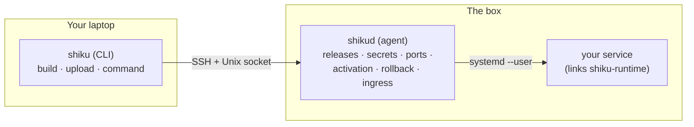

# Shiku

[](https://github.com/defrag-au/shiku/actions/workflows/ci.yml)
[](#license)

**Deploy native Rust binaries to a single Linux box — declaratively, atomically, and safely.**

You run `shiku deploy <app>`; Shiku cross-compiles your binary, content-hashes
it, ships it to the box, and an on-box agent atomically activates it behind a
health check — rolling back automatically if the new release doesn't come up
healthy. Secrets are encrypted at rest and injected at activation;
service-to-service URLs resolve themselves; public HTTPS hostnames are wired
through a Cloudflare Tunnel on request.

In one phrase: **"Wrangler for things that don't run on Cloudflare."**

## Why it exists

Edge runtimes are great until you need a real, long-lived process — a
simulation server, an LLM narrator, a gateway bot. Those need a box. The usual
options are either too much or too little:

| Alternative | Why not |
| --- | --- |
| Kubernetes | Absurd overhead for one box. |
| Docker images | Adds an image-build story you don't need with static musl binaries. |
| Hand-rolled `scp` + `systemctl` | No rollback, no secret management, no health gating, no ingress. |
| Nomad / systemd-only | Either heavy, or missing the deploy ergonomics. |

Shiku is the deliberately-small middle: atomic, health-gated, secret-aware
deploys of native binaries to one box, and *nothing more*. No multi-box, no
Docker, no web UI — those boundaries are features.

## The three pieces



- **`shiku`** (the CLI, on your laptop) builds the binary, hashes it, rsyncs it
  to the box, and sends commands to the agent over an SSH-tunnelled Unix socket.
- **`shikud`** (the agent, on the box) runs as a `systemd --user` service and
  owns all on-box state — releases, secrets, port assignments — performing
  activation, rollback, and ingress.
- **`shiku-runtime`** (the library your service links) lets the service
  *declare what it needs* in code (secrets, bindings, a listen port), and
  provides health-endpoint and graceful-shutdown helpers.

Two support crates back them: **`shiku-types`** (the wire protocol, the single
source of truth for the contract) and **`shiku-macros`** (the `secret!` /
`binding!` / `listen_http!` proc-macros, re-exported from the runtime).

## The contract, in one idea

The thread tying Shiku together is a **code-declared needs manifest**. Your
service says, in code:

```rust
#[tokio::main]
async fn main() -> anyhow::Result<()> {
    shiku_runtime::init();

    let token = shiku::secret!("BOT_TOKEN");   // declared + resolved
    let addr  = shiku::listen_http!();          // a port, allocated for you
    // …
}
```

At build time those declarations are collected into a manifest the binary
prints with `--shiku-manifest`. At deploy time the agent runs the binary with
that flag, reads what it needs, and *provisions exactly that* — decrypts and
injects the secret, allocates the port. The binary declares its requirements;
the platform satisfies them; the two can't drift, because the manifest comes
from the binary itself.

## Quickstart

**1. Install the CLI** (on your laptop):

```sh
cargo install --git https://github.com/defrag-au/shiku shiku
```

**2. Bootstrap a box** (one-time per service-user):

```sh
shiku bootstrap init --host my-box --admin <sudo-user> \
  --user <service-user> --github <gh-user>
shiku ping        # → pong
```

**3. Describe the app** in a `shiku.toml` at your project root:

```toml
[shiku]
default_env = "prod"

[apps.my-service]
package = "my-service"          # cargo package to build

[apps.my-service.env.prod]
deploy_host = "my-box"
ssh_user    = "<service-user>"
public      = ["my-service.example.com"]   # optional public hostname
```

**4. Declare needs in code** (link `shiku-runtime`) and **deploy**:

```sh
shiku secret set BOT_TOKEN     # masked prompt
shiku deploy my-service        # build → upload → activate → health-check
shiku logs my-service -f       # follow output
```

If the new release fails its health check, Shiku rolls back automatically.

See **[docs/getting-started.md](docs/getting-started.md)** for the full walkthrough.

## Command reference

| Command | What it does |
| --- | --- |
| `shiku ping [app]` | Health-check the agent for an app's environment. |
| `shiku deploy [app]` | Build, upload, and atomically activate in one shot. |
| `shiku rollback [app]` | Roll back to the previously activated release. |
| `shiku restart [app]` | Restart without redeploying (picks up rotated secrets). |
| `shiku status [app] [--all]` | Current sha, systemd state, uptime. |
| `shiku logs [app] [--no-follow] [--since]` | Stream journald output. |
| `shiku env [app]` | Show injected env (secrets masked). |
| `shiku secret set\|list\|remove\|rotate` | Manage encrypted secrets. |
| `shiku release upload\|activate\|list` | Lower-level release control. |
| `shiku app register\|remove\|list\|inspect` | Manage app registrations. |
| `shiku config show` | Print the resolved config (debugging aid). |
| `shiku bootstrap init\|upgrade` | Provision a box / upgrade the agent. |
| `shiku tunnel bootstrap\|status\|zones\|upgrade` | Cloudflare Tunnel ingress. |

`--env` selects the environment (falls back to `shiku.default_env`); the app
name can be omitted when `shiku.toml` defines exactly one app.

## Documentation

| Guide | Covers |
| --- | --- |
| [Getting started](docs/getting-started.md) | Install, bootstrap a box, first deploy. |
| [Deploying services](docs/deploying.md) | `shiku.toml`, declaring needs, the deploy flow. |
| [Secrets](docs/secrets.md) | Encrypted-at-rest secrets, rotation. |
| [Public ingress](docs/ingress.md) | Cloudflare Tunnel, public hostnames. |
| [Operations](docs/operations.md) | Daily workflow: status, logs, rollback, multi-env. |
| [CLI reference](docs/cli-reference.md) | Every command and flag. |

## Development

Requires a recent stable Rust toolchain.

```sh
just check    # cargo check the workspace
just lint     # clippy, warnings as errors
just test     # run tests
just shiku -- ping             # run the CLI locally
just build-arm                 # cross-compile CLI + agent for an arm64 box
```

The box-target build uses [`cargo-zigbuild`](https://github.com/rust-cross/cargo-zigbuild)
to produce a static `aarch64-unknown-linux-musl` binary.

## License

Licensed under either of [MIT](LICENSE-MIT) or [Apache-2.0](LICENSE-APACHE) at
your option. Unless you explicitly state otherwise, any contribution
intentionally submitted for inclusion in the work by you shall be dual-licensed
as above, without any additional terms or conditions.
