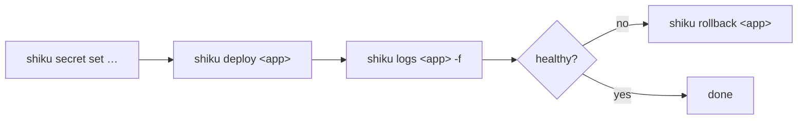

# Operations

The daily workflow once a box is bootstrapped and an app is live. This is the
operator's counterpart to [Deploying services](deploying.md).

## The daily loop



```sh
shiku deploy my-service        # build → upload → activate → health-check
shiku logs my-service -f       # follow journald output
shiku status my-service        # current sha, systemd state, uptime
```

A failed deploy rolls back automatically — deploys are safe to retry.

## Watching what's running

```sh
shiku status [app]             # one app, or the project's app
shiku status --all             # every app the agent knows about
shiku logs <app> [-f]          # stream logs; --no-follow to dump and exit
shiku logs <app> --since "1 hour ago"
```

`shiku status` reports each app's registration, systemd state, uptime, and the
current and previous release shas.

## Rolling back and restarting

```sh
shiku rollback <app>           # swap back to the previous release
shiku restart <app>            # re-render env + restart, no redeploy
```

`restart` is also how a **rotated secret takes effect** — the env file is read
at process start, so changing a secret value needs a restart to regenerate it.
See [Secrets](secrets.md).

## Inspecting state safely

```sh
shiku env <app>                # resolved vars, bindings, listen addr —
                               # secrets SHOWN MASKED
shiku config show [app]        # the resolved view of your shiku.toml
shiku app inspect <app>        # the on-box config the agent actually holds
```

`shiku env` is the supported way to see what got injected. **Never `cat` the env
file** — see [Secrets](secrets.md) for why.

## Multi-environment apps

`shiku.toml` supports multiple environments per app, with a `default_env`. The
`--env` flag selects which one applies; omitting it falls back to the default:

```sh
shiku deploy my-service --env dev
shiku deploy my-service --env prod
```

One project config drives both a dev box and a prod box — the only difference at
the command line is `--env`. When a project defines exactly one app, the app
name can be omitted too.

## The operator's checklist

- **Deploys are safe to retry** — atomic activation and auto-rollback mean a
  failed deploy reverts cleanly.
- **Rotating a secret needs a `restart`** — the env file is read at start.
- **Inspect with `shiku env`, never `cat`.**
- **`Stuck` is the only state that needs you** — it means both activation *and*
  rollback failed. Everything else resolves to `Activated` or `RolledBack`
  automatically.
- **Bindings wire themselves** — declare `binding!("other-app")` and the URL
  appears in the environment; no manual wiring.
